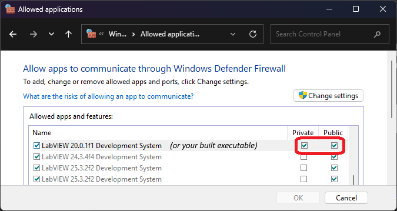
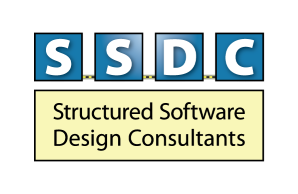

# G Industrial Camera

YOU get an industrial camera driver for LabVIEW and YOU get an industrial camera driver for LabVIEW.

This library is intended to provide a simple LabVIEW driver for use with `GenICam` compatible cameras and is built on the incredible [Aravis](https://github.com/AravisProject/aravis) library.

The library is created with LabVIEW 2020 and is suitable for Windows x86/x64 platforms, Linux x64. NI-LinuxRT support is planned. 

## Licence
The LabVIEW source is distributed under the Zero-Clause BSD licence. The shared binary component of this toolkit is distributed under the LGPL-2.1 licence - see [COPYING](LabVIEW/g_industrial_cam/bin/COPYING) for the full text of the licence (including dependency licences).

## Getting Started

This library is still in beta (whilst folks test it on different cameras) but there are [releases on VIPM.io](https://www.vipm.io/package/serenial_lib_g_industrial_camera/) and also non-vipm source distributions available on the [releases page](https://gitlab.com/serenial/g-industrial-camera/-/releases).

If you require a build of the shared-binaries with debug symbols then please see the instructions to build from source.

### Camera Setup

#### Manufacturer Software Requirements
It is recommended that you install the drivers and utilities provided by the Camera's manufacturer - this will allow you to verify the connection of your camera and ensure that drivers are present on the system.

#### Network/Firewall Configuration with GigE Cameras
Ensure that LabVIEW or your built application isn't blocked by a firewall for GigE Cameras. Windows may classify static-IP attached devices as a "private network" which might cause traffic to be blocked (especially UDP traffic). Check Windows Defender to ensure LabVIEW or your executable aren't blocked and that both `private` and `public` are checked.



#### USBVision Drivers on Windows
Some USBVision devices will not be detected by the library (like Basler devices) without modifying the USB driver that the Windows OS associates with them. A walkthough of the configuration process (using `zadig`) and its reversal are a work in progress but they loosely follow the steps outlined here [Swapping USB3 Device Driver on Windows to use `libsub`](https://github.com/AravisProject/aravis/issues/431#issuecomment-1092243935)

### Development Setup

If you want to develop the library then you require the following (C++ development tools only required if you want to build the C++ source)

#### LabVIEW
* LabVIEW 2020 or LV2024 Q3 onwards (to preserve the source version to 2020)
* LUnit (from VIPM.io)
* Vision Acquisition Software (_without_ the NI-IMAQdx driver so no activation required) if you would like to use/build the IMAQ integration example


#### C++ Development (Windows x86/x64)
[Build Tools for Windows 2022 - MSVC C++ Build Tools](https://visualstudio.microsoft.com/downloads/#build-tools-for-visual-studio-2022) or newer

#### C++ Development (Linux x64)
* Yours system's build tools (g++, make, nasm, autoconf etc)
* cmake 3.27 or greater
* libudev-dev

### Cloning the Repository

Please ensure you are cloning this repo from [GitLab](https://gitlab.com/serenial/g-industrial-camera.git). Any issues should also be raised there! The GitHub mirror is only used for the unlimited build minutes.

When cloning ensure you use `recursive` clone

```bash
git clone --recursive https://gitlab.com/serenial/g-industrial-camera.git
```

If you already have cloned the top-level repo then use
```bash
git submodule update --init --recursive
```

This will ensure that the `vcpkg` submodule is setup as required.

### Building the Shared Binaries from Source

If you only want the binaries for LabVIEW development then you might find it easier to use the provided `x86-win-build.bat`, `x64-win-build.bat` or `x64-linux-dektop-build.sh`. These should setup `vcpkg`, build the dependencies and then build and install the `.dll` or `.so` into the `LabVIEW/g_industrial_cam/bin` directory.

### VSCode Setup

**When using VSCode on Windows ensure you launch it from the `x86 Native Tools Command Prompt` or the `x64 Native Tools Command Prompt`** (depending on your required bitness). The command `code` should launch VSCode.

#### VSCode Extensions
* C/C++ (Microsoft)
* CMake Tools (Microsoft)

#### VSCode Configuration
Launch Files which setup a debugging launch task are included in example `.vscode-example-<platform>` directories

#### Build Using CMake and CMakePresets.json
VSCode should read the `CMakePresets.json` file and provide a `debug` and `release` configuration and build preset. These can be launched from the [CMake Tooling](https://github.com/microsoft/vscode-cmake-tools/blob/main/docs/cmake-presets.md) 

Check the build output for any errors. **You will have to close LabVIEW for the build and "install" to succeed**

## Contributions
Open to contributions - please open an issue _on GitLab_ to discuss

## TODO
- [x] Dependency Licence Notices
- [x] Enumerate Cameras
- [x] Start Stream
- [x] Stop Stream
- [x] Capture Frame
- [ ] Documentation
- [x] Distribution Packages
- [ ] Walk Camera Config
- [ ] Modify Camera Config

## Support
The development of this library is in-part thanks to the generous support from:

<div style="display:flex;justify-content:left;">
<a href="https://ssdc.co.uk/"></a>
<a href="https://controlsoftwaresolutions.com/"></a>
</div>

(❤️)