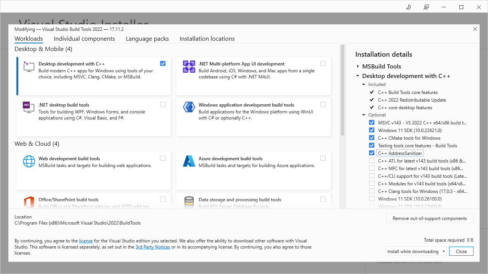

# G Industrial Camera

YOU get an industrial camera driver for LabVIEW and YOU get an industrial camera driver for LabVIEW.

This library is intended to provide a simple LabVIEW driver for use with GenICam compatible cameras.

# Licence
The LabVIEW source is distributed under the Zero-Clause BSD licence. The shared binary component of this toolkit is distributed under the LGPL-2.1 licence.

A licence file which contains the list of dependencies to provide to end users is under construction 

## Supported Platforms
The LabVIEW code is written in LabVIEW 2020 SP1 and provides binaries for the following platforms:

| Platform | Supported |
|----------|-----------|
| Windows x86 | 🚧 |
| Windows x64 | 🚧 |
| Linux x64 | 🚧 |
| NI-LinuxRT x64 | 🚧❔ |
| NI-LinuxRT ARM | ❌ |
| MacOS (x86-64 or Apple Silicon) | ❌ |

## Developement Setup

The library consists of two components - LabVIEW code and a shared library built from C++ code. This repository does not include the pre-built binaries as these would ideally be built from source as this provides the option to enable the debugging symbols on the build.

### Building for Windows Dependencies

Install the following:

* [Build Tools for Windows 2022 - MSVC C++ Build Tools](https://visualstudio.microsoft.com/downloads/#build-tools-for-visual-studio-2022) (Newer versions should work but you will have to update the build scripts later)
* CMake 3.27 or later (This can be installed as part of the MSVC Build Tools)
* (Ninja Build)[https://github.com/ninja-build/ninja/releases] (accessible on the System's Path)

This screenshot shows the recommended items to install for MSVC Build Tools


### Building for Linux Dependencies
* autoconf
* libudev-dev
* #TODO

### Cloning the Respository

This respository uses git submodules to manage build tooling. When cloning ensure you use

```bash
git clone --recursive https://gitlab.com/serenial/g-industrial-camera.git
```

If you already have cloned the top-level repo then use
```bash
git submodule update --init --recursive
```

#### Bootstrapping `vcpkg`

Open a command prompt at the root of this repository and run either `vcpkg/bootstrap-vcpkg.bat` if you are on Windows or `vcpkg/bootstrap-vcpkg.sh` on Linux platforms.

### Building Shared Binaries

If you use `VSCode` with the `C++` and `CMake` extensions installed then you can use the CMake Integration to select and build either the `release` or `debug` configurations. If you are using `VScode` on Windows, ensure you launch it by entering `code` into the `Visual Studio Developer Command Prompt` (choose the `x86` or `x64` prompt depending on if you want to build for 32 or 64 bit).

Example build scripts are provided to allow for easy building without VSCode:

Windows users should copy the `x<Arch>-win-build.bat-example` files and update the extension to `.bat`. If you are using a different version of MSVC then you will have to update the `call "C:\Program Files (x86)\Microsoft Visual Studio\2022\BuildTools\VC\Auxiliary\Build\vcvars64.bat` path to the location for your MSVC `vcvars` setups scripts on your system.

Linux users can run `x64-linux-dektop-build.sh ` but might need to make the file executable using `chmod +x` first.

The binary build will take some time as all the dependencies are built from source. The binaries will be copied into `LabVIEW/g_industrial_cam/bin` when done.

## Contributions
Open to contributions - please open an issue to discuss

## Usage

**ENSURE YOU HAVE INSTALED THE DRIVERS FOR THE DEVICE ON YOUR SYSTEM**

For example "Pylon" for Basler cameras.

### Windows libusb setup
Windows doesn't always play nice with libusb so look at the resources section to see guides on how to make the OS use a libusb compatible driver. #TODO - explain this properly

## TODO
- [ ] Dependency Licence Notices
- [ ] Enumerate Cameras
- [ ] Start Stream
- [ ] Stop Stream
- [ ] Capture Frame
- [ ] Documentation
- [ ] Distribution Packages

## Resources
* [Swapping USB3 Device Driver on Windows to use `libsub`](https://github.com/AravisProject/aravis/issues/431#issuecomment-1092243935) - note: Use Windows Device Manager to swap back to the original driver to see the Basler Device in Pylon again.